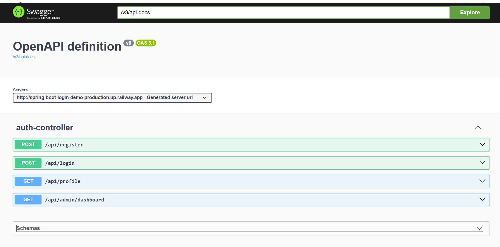
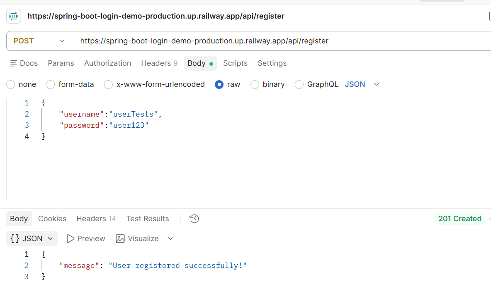
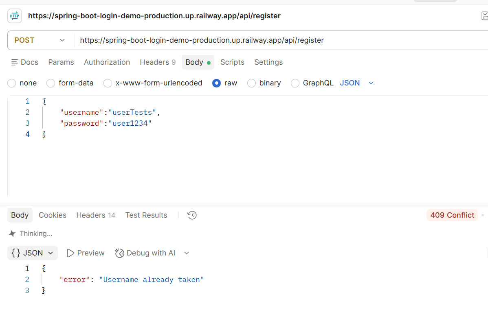
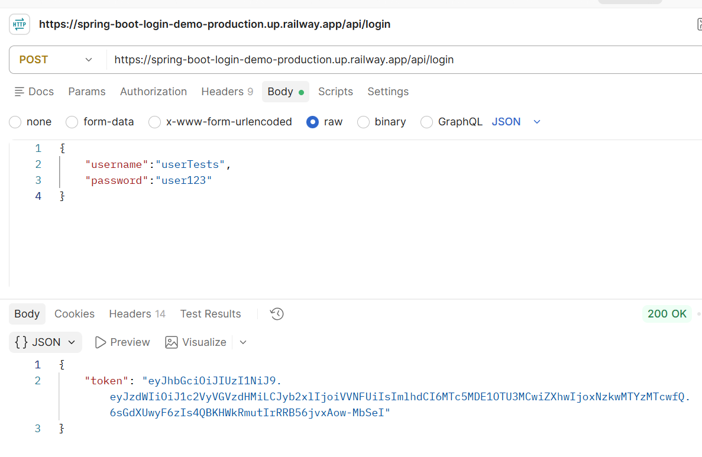
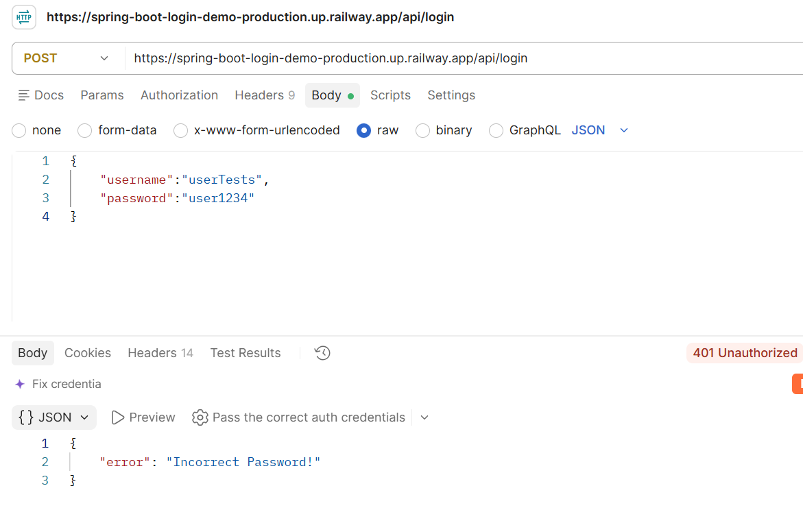
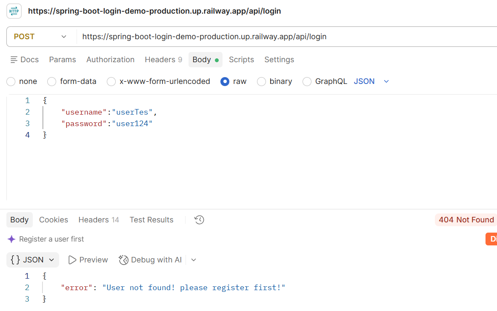
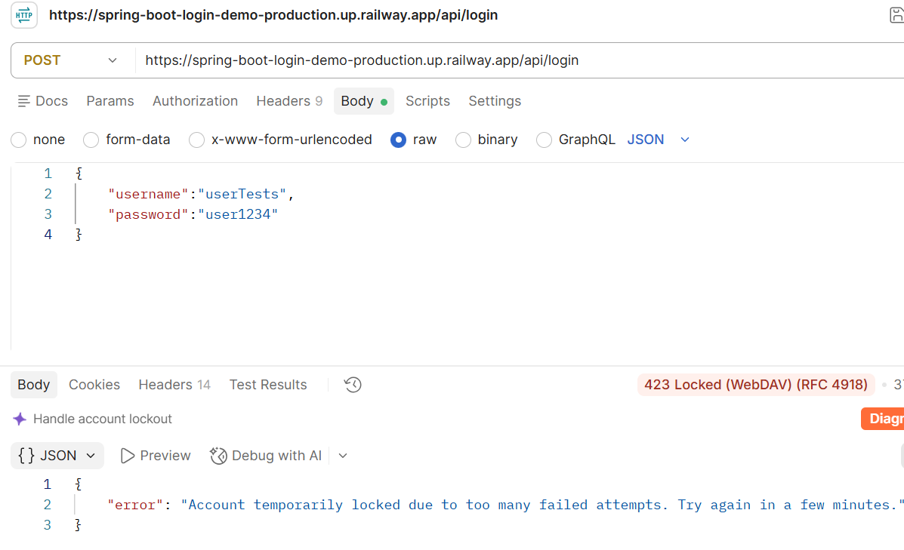
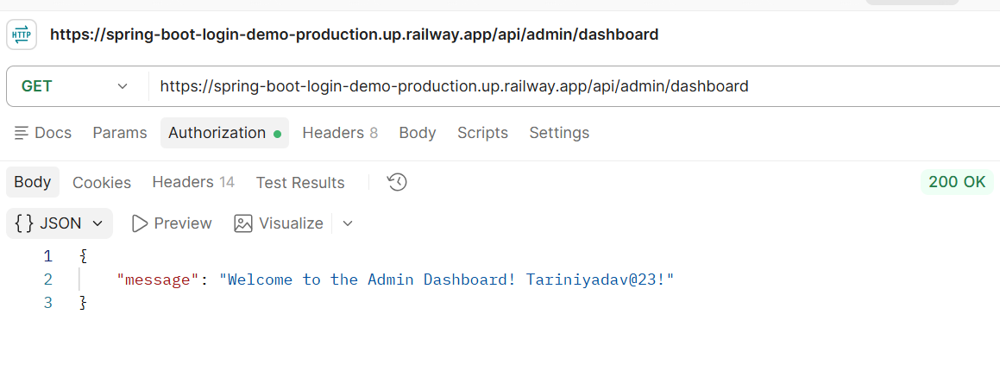

# Spring Boot Login Demo — Secure Authentication System

A production-pattern authentication and authorization system built with Spring Boot, featuring JWT-based stateless auth, role-based access control, and a full security hardening pipeline.

🔗 **Live demo:** https://spring-boot-login-demo-production.up.railway.app  
📘 **API docs (Swagger UI):** https://spring-boot-login-demo-production.up.railway.app/swagger-ui/index.html

---

## Features

- **Password security** — BCrypt hashing; passwords are never stored or logged in plain text
- **Spring Security** — endpoint-level access control with a custom `SecurityFilterChain`
- **JWT authentication** — stateless, signed tokens issued on login; no server-side sessions (`SessionCreationPolicy.STATELESS`)
- **Role-based authorization (RBAC)** — `USER` and `ADMIN` roles with route-level restrictions; roles are always server-assigned, never client-controlled
- **Input validation** — request-level validation (`@Valid`, `@NotBlank`, `@Size`) with clean, structured error responses
- **Centralized exception handling** — a global `@RestControllerAdvice` ensures no stack traces or internal details ever reach the client
- **Brute-force protection** — accounts are temporarily locked (5 failed attempts → 5-minute lockout) to mitigate credential-stuffing attacks
- **Externalized secrets** — database credentials are environment-based, not hardcoded
- **REST-compliant status codes** across every endpoint
- **Interactive API docs** — OpenAPI/Swagger UI auto-generated from the codebase

## Tech Stack

| Layer | Technology |
|---|---|
| Language | Java 21 |
| Framework | Spring Boot 4.1.1 |
| Security | Spring Security, JJWT (JSON Web Tokens) |
| Persistence | Spring Data JPA + Hibernate |
| Database | PostgreSQL (Neon, cloud-hosted) | 
| Docs | springdoc-openapi (Swagger UI) |
| Deployment | Railway (Docker-based) |
| Build | Maven |

## API Endpoints

| Method | Endpoint | Access | Success | Failure Cases |
|---|---|---|---|---|
| POST | `/api/register` | Public | `201 Created` | `409` username taken, `400` validation error |
| POST | `/api/login` | Public | `200 OK` (returns JWT) | `401` wrong password, `404` user not found, `423` account locked |
| GET | `/api/profile` | Authenticated | `200 OK` | `401` not authenticated |
| GET | `/api/admin/dashboard` | `ADMIN` only | `200 OK` | `403` insufficient role |

Full interactive documentation, including request/response schemas, is available via [Swagger UI](https://spring-boot-login-demo-production.up.railway.app/swagger-ui/index.html).

## Architecture Overview

Client → JwtFilter → Spring Security Filter Chain → Controller
↓
GlobalExceptionHandler
↓
Clean JSON response


- `JwtFilter` intercepts every request, validates the token (if present), and populates the Spring Security context with the authenticated user's identity and role.
- `SecurityConfig` defines which endpoints are public, which require authentication, and which require a specific role — and enforces a stateless session policy.
- `LoginAttemptService` tracks failed login attempts in memory (`ConcurrentHashMap`) and temporarily locks an account after repeated failures; the lock clears itself automatically once the time window passes.
- `GlobalExceptionHandler` intercepts validation errors and all other exceptions application-wide, converting them into consistent, client-safe JSON responses.

## Project Structure Highlights

- `AuthController.java` — REST endpoints for register, login, profile, and admin routes
- `SecurityConfig.java` — Spring Security filter chain, stateless session policy, route authorization rules
- `JwtFilter.java` / `JwtUtil.java` — JWT token generation, validation, and request filtering
- `LoginAttemptService.java` — brute-force protection via failed-attempt tracking and temporary lockout
- `GlobalExceptionHandler.java` — centralized validation and error handling
- `Users.java` — user entity with a unique username constraint and a server-controlled role field

## Security Design Notes

- **Database credentials are never committed to source control.** They are injected via environment variables (`DB_URL`, `DB_USERNAME`, `DB_PASSWORD`) — locally via a git-ignored `application-local.properties`, and in production via Railway's environment variable settings.
- **New users can never self-assign a role.** The `role` field is always set server-side to `USER` on registration, regardless of what the client sends — preventing privilege escalation via the registration endpoint.
- **Login lockout is time-bound and automatic.** After 5 failed attempts, an account is locked for 5 minutes; the lock clears itself once the window passes, with no manual intervention needed.

## Running Locally

1. Clone the repo and open it in your IDE:
```bash
   git clone https://github.com/tarini-codes/spring-boot-login-demo.git
```
2. Create `src/main/resources/application-local.properties` with:
```properties
   DB_URL=<your-postgres-jdbc-url>
   DB_USERNAME=<your-db-username>
   DB_PASSWORD=<your-db-password>
   JWT_SECRET=<a-32+-character-random-string>
```
3. Run with the `local` Spring profile active:
```bash
   ./mvnw spring-boot:run -Dspring-boot.run.profiles=local
```
4. Visit `http://localhost:8080/swagger-ui/index.html` to explore the API.

## What This Project Demonstrates

This started as a basic login/register demo and was incrementally hardened into a security-conscious REST API — covering the gap between "it works" and "it's safe to ship." Each stage (hashing → Spring Security → JWT → RBAC → validation → secrets management → rate limiting → documentation) was added and independently verified, both locally and in a live Railway deployment.

## Screenshots

### API Documentation (Swagger UI)


### Register
**Successful registration (201 Created)**


**Duplicate username (409 Conflict)**


### Login
**Successful login with JWT token (200 OK)**


**Wrong password (401 Unauthorized)**


**Unknown user (404 Not Found)**


**Account locked after 5 failed attempts (423 Locked)**


### Protected Routes
**Accessing profile without authentication (401 Unauthorized)**


**Admin dashboard access with valid ADMIN token (200 OK)**
