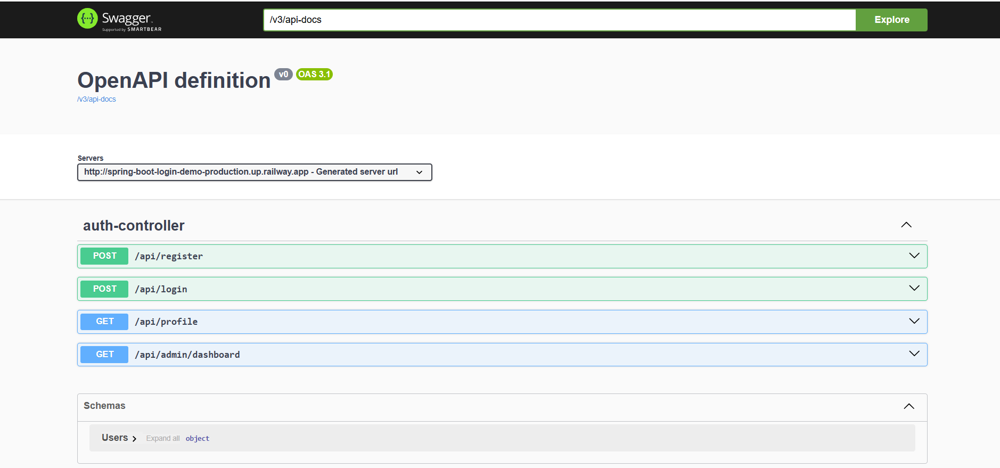
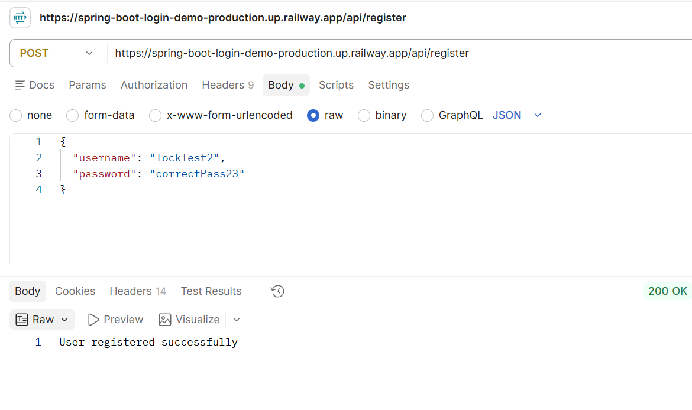
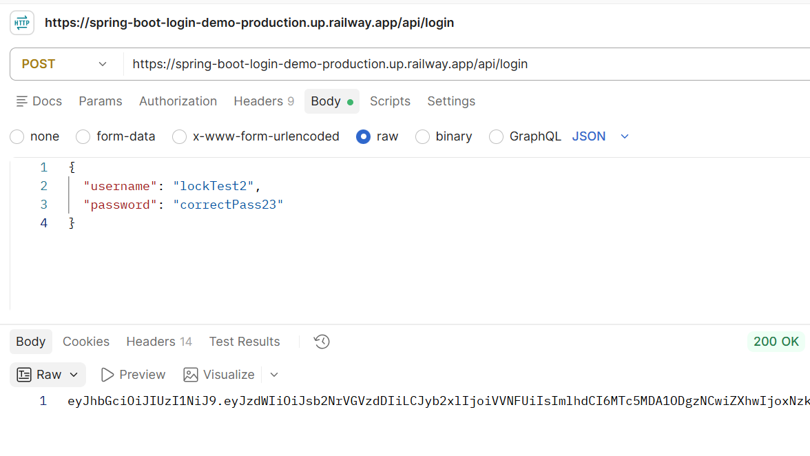
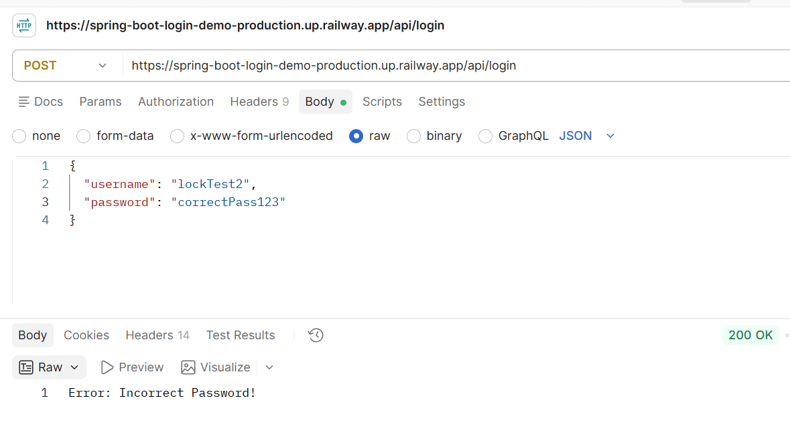
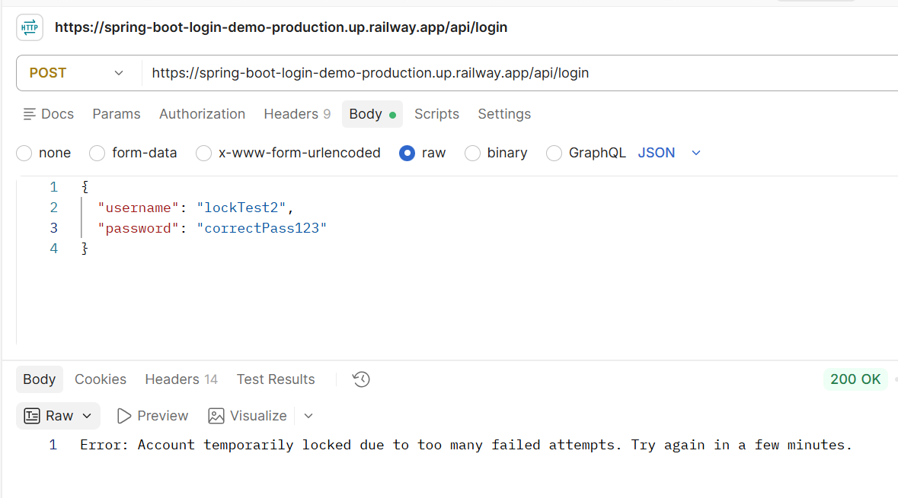

# Spring Boot Login Demo — Secure Authentication System

A production-pattern authentication and authorization system built with Spring Boot, featuring JWT-based stateless auth, role-based access control, and a full security hardening pipeline.

🔗 **Live demo:** https://spring-boot-login-demo-production.up.railway.app  
📘 **API docs (Swagger UI):** https://spring-boot-login-demo-production.up.railway.app/swagger-ui/index.html

---

## Features

- **Password security** — BCrypt hashing; passwords are never stored or logged in plain text
- **Spring Security** — endpoint-level access control with a custom `SecurityFilterChain`
- **JWT authentication** — stateless, signed tokens issued on login; no server-side sessions
- **Role-based authorization (RBAC)** — `USER` and `ADMIN` roles with route-level restrictions
- **Input validation** — request-level validation (`@Valid`) with clean, structured error responses
- **Centralized exception handling** — a global `@RestControllerAdvice` ensures no stack traces or internal details ever reach the client
- **Rate limiting / account lockout** — accounts are temporarily locked after repeated failed login attempts, mitigating brute-force attacks
- **Externalized secrets** — no credentials or signing keys are hardcoded; all sensitive config is environment-based
- **Interactive API docs** — OpenAPI/Swagger UI auto-generated from the codebase

## Tech Stack

| Layer | Technology |
|---|---|
| Language | Java 21 |
| Framework | Spring Boot 4.1.1 |
| Security | Spring Security, JJWT (JSON Web Tokens) |
| Persistence | Spring Data JPA + Hibernate |
| Database | PostgreSQL (Neon, cloud-hosted) |
| Docs | springdoc-openapi (Swagger UI) |
| Deployment | Railway (Docker-based) |
| Build | Maven |

## API Endpoints

| Method | Endpoint | Access | Description |
|---|---|---|---|
| POST | `/api/register` | Public | Register a new user (default role: `USER`) |
| POST | `/api/login` | Public | Authenticate and receive a JWT |
| GET | `/api/profile` | Authenticated | Returns the logged-in user's profile |
| GET | `/api/admin/dashboard` | `ADMIN` only | Example role-restricted endpoint |

Full interactive documentation, including request/response schemas, is available via [Swagger UI](https://spring-boot-login-demo-production.up.railway.app/swagger-ui/index.html).

## Architecture Overview
Client → JwtFilter → Spring Security Filter Chain → Controller
↓
GlobalExceptionHandler
↓
Clean JSON response


- `JwtFilter` intercepts every request, validates the token (if present), and populates the Spring Security context with the authenticated user's identity and role.
- `SecurityConfig` defines which endpoints are public, which require authentication, and which require a specific role.
- `LoginAttemptService` tracks failed login attempts in memory and temporarily locks an account after repeated failures.
- `GlobalExceptionHandler` intercepts all exceptions application-wide and converts them into consistent, client-safe JSON responses.

## Security Design Notes

- **JWT secret and database credentials are never committed to source control.** They are injected via environment variables (`JWT_SECRET`, `DB_URL`, `DB_USERNAME`, `DB_PASSWORD`) — locally via a git-ignored `application-local.properties`, and in production via Railway's environment variable settings.
- **New users can never self-assign a role.** The `role` field is always set server-side to `USER` on registration, regardless of what the client sends — preventing privilege escalation via the registration endpoint.
- **Login lockout is time-bound and automatic.** After 5 failed attempts, an account is locked for 5 minutes; the lock clears itself once the window passes, with no manual intervention needed.

## Running Locally

1. Clone the repo and open it in your IDE.
2. Create `src/main/resources/application-local.properties` with:
```properties
   DB_URL=<your-postgres-jdbc-url>
   DB_USERNAME=<your-db-username>
   DB_PASSWORD=<your-db-password>
   JWT_SECRET=<a-32+-character-random-string>
```
3. Run with the `local` Spring profile active (`-Dspring.profiles.active=local`).
4. Visit `http://localhost:8080/swagger-ui/index.html` to explore the API.

## What This Project Demonstrates

This started as a basic login/register demo and was incrementally hardened into a security-conscious REST API — covering the gap between "it works" and "it's safe to ship." Each stage (hashing → Spring Security → JWT → RBAC → validation → secrets management → rate limiting → documentation) was added and independently verified, both locally and in a live Railway deployment.

## Screenshots

### Swagger UI — API Documentation


### Successful Authentication



### Rate Limiting / Account Lockout


